  
  

<h1 align="center"> 👋 Hi, I'm Shreshth Sahu

##  🚀 Data Scientist | Machine Learning Engineer | Python Developer

I am a Computer Science undergraduate passionate about transforming raw data into meaningful insights through **Data Science, Machine Learning, Artificial Intelligence, and Analytics**. I enjoy solving real-world business problems using **Python, SQL, Power BI, and Machine Learning**.

---

## 🚀 About Me

- 🎓 B.Tech in Computer Science Engineering – Lovely Professional University
- 📊 Interested in Data Science, Machine Learning & AI
- 💻 Strong foundation in Python, SQL, Data Structures & Algorithms
- 📈 Building Business Analytics Dashboards using Power BI & Excel
- 🤖 Exploring Generative AI, LLMs & Prompt Engineering
- 🌱 Currently learning Advanced Machine Learning, Data Engineering & Cloud
- 🎯 Goal: Become a Data Scientist at a Product-Based Company

---

## 🛠 Tech Stack

### Languages
`Python` `SQL` `Java` `JavaScript` `C++` `C`

### Data Science & ML
`Pandas` `NumPy` `Matplotlib` `Scikit-Learn` `OpenCV`

### Databases
`MySQL`

### Visualization
`Power BI` `Microsoft Excel`

### Web Development
`HTML` `CSS` `JavaScript` `Django` `Node.js`

### Tools
`Git` `GitHub` `VS Code` `Cisco Packet Tracer`

---

## 📚 Currently Learning

- Machine Learning
- Deep Learning
- Generative AI
- Data Engineering
- Oracle Cloud & Azure
- Advanced SQL
- Power BI (DAX)
- Statistics for Data Science

---

## 🚀 Featured Projects

### 🏥 Hospital Management System
- Appointment scheduling & workflow optimization
- Django backend with authentication
- Database management & responsive UI

**Tech:** Python, Django, HTML, CSS

### 📊 Retail Sales Analytics
- Revenue & customer trend analysis
- Business insights dashboard
- Data visualization with Python

**Tech:** Python, Pandas, Matplotlib

### 📈 HR Analytics Dashboard
- Employee attrition analysis
- Department & salary insights
- KPI-based Power BI dashboard

**Tech:** Power BI, Excel

### 🚗 Car Sales Dashboard
- Interactive sales dashboard
- Pivot tables & business KPIs
- Customer trend analysis

**Tech:** Excel

### 📱 AI Phone Detection System
- Real-time webcam-based detection
- OpenCV-powered monitoring system

**Tech:** Python, OpenCV

---

## 🏆 Certifications

- Oracle Cloud Infrastructure 2025 Certified AI Foundations Associate
- ChatGPT Prompt Engineering: Generative AI & LLM
- Introduction to Machine Learning (NPTEL)
- Build Generative AI Apps with No-Code Tools
- Python with Data Science Certification
- Java Programming Certification

---

## 📊 GitHub Analytics

  

---

## 🤝 Connect With Me

- 📧 Email: **shreshthsahu1111@gmail.com**
- 💼 LinkedIn: **https://linkedin.com/in/shreshth-sahu**
- 🌐 Portfolio: **https://shreshth-portfolio.vercel.app**
- 🐙 GitHub: **https://github.com/Shreshthsahu1**

---

## 💡 Quote

> "Turning Data into Decisions."

⭐ If you like my work, consider following my GitHub profile and exploring my repositories!
